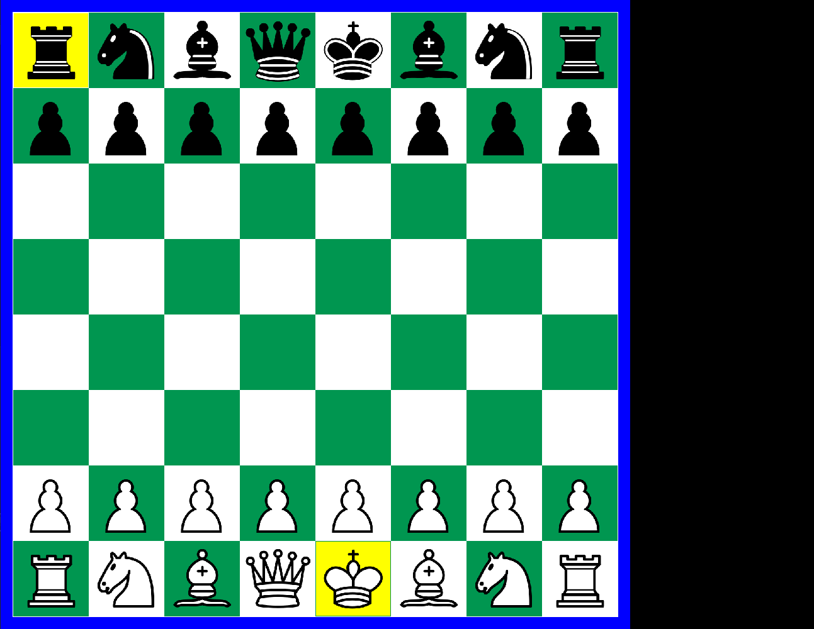

# Chess engine
First engine with little experience of C++

## Features
- 64 int based board
- 32 bit move based engine
- Opening book
- Perft command

## Controlls
- Space undo
- Backspace rotate board
- 3 to 9 is search depth
- Perft: write perft X in the terminal
